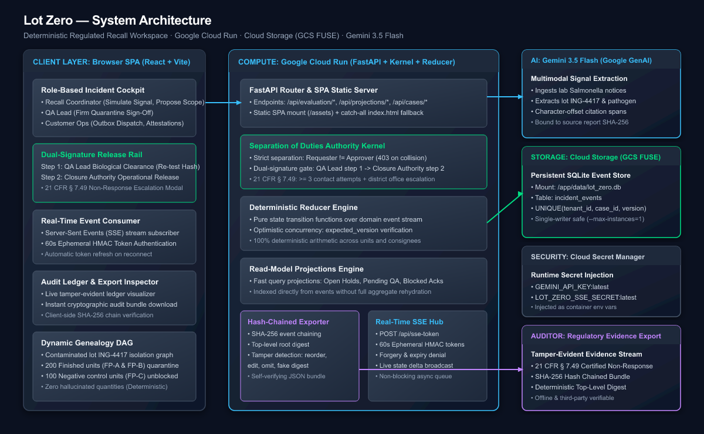

# Lot Zero — Evidence-Backed Food Safety Recall Incident Workspace

> **Disciplined, Deterministic Event-Sourced Recall Incident Workspace**  
> *Powered by Gemini 3.5 Flash on Google Vertex AI, Append-Only SQLite Event Store on GCS FUSE, Strict Separation of Duties Authority Kernel, FastAPI, and React Dashboard.*

[](https://lot-zero-1051797806634.us-central1.run.app)
[](https://cloud.google.com/vertex-ai)
[](apps/api/tests/)

**Live Production Deployment**: [**https://lot-zero-1051797806634.us-central1.run.app**](https://lot-zero-1051797806634.us-central1.run.app)

---

## 1. Product & Architecture Overview

**Lot Zero** converts incoming safety signals (e.g., laboratory Salmonella contamination reports) into an auditable, tamper-evident incident management process:



### Core Architectural Pillars

1. **Deterministic Domain Kernel & Authenticity Reducer** ([`kernel.py`](apps/api/src/lot_zero/domain/kernel.py), [`reducer.py`](apps/api/src/lot_zero/domain/reducer.py)):
   - The reducer never invents quantities, recipients, hashes, or statuses; required quantity fields prevent silent zero-hold fallbacks.
   - Operational quantities and containment scopes are computed deterministically by `compute_impact()` from supply chain records and are never model-derived, with model outputs strictly restricted to ingredient lot and pathogen identification subject to mechanical character-offset grounding checks. Clean negative control batches (`FP-100-ADJ`) remain unblocked, and unresolved topology boundaries (`EDGE-BROKEN-01`) are surfaced explicitly without hold corruption.
   - State machine transitions are mediated strictly by `AdvancePhaseCommand` verifying allowed target phases and role permissions before recording events into the tamper-evident ledger hash chain.

2. **Grounded Extraction via Gemini 3.5 Flash on Vertex AI** ([`gemini_agent.py`](apps/api/src/lot_zero/domain/gemini_agent.py)):
   - Ingests raw lab reports with mechanical character-offset citation spans dynamically anchored to the document's computed SHA-256 digest using `gemini-3.5-flash` via the official `google-genai` SDK on Vertex AI (`location="global"`), with automatic rejection of non-verbatim quotes.

3. **Append-Only SQLite Event Store on GCS FUSE** ([`sqlite_repository.py`](apps/api/src/lot_zero/adapters/sqlite_repository.py)):
   - Append-only `incident_events` table with schema `UNIQUE(tenant_id, case_id, stream_version)`.
   - Optimistic concurrency control via `expected_version` checks.
   - Persistent across container restarts via Google Cloud Storage FUSE mount (`/app/data/lot_zero.db`).

4. **Strict Separation of Duties & Dual-Signature Release Rail**:
   - Server-enforced role gates reject self-approvals with **HTTP 403 Forbidden** (`requester and approver must be different people`).
   - **Step 1:** QA Lead Biological Clearance (verifies negative re-test documentation SHA-256 hash).
   - **Step 2:** Closure Authority Operational Release.
   - **Non-Response Closure:** Strict FDA 21 CFR § 7.49 regulatory referral path requiring $\ge 3$ documented contact attempts and district office escalation notes.

5. **Cryptographic Tamper-Evident Audit Export** ([`audit_export.py`](apps/api/src/lot_zero/domain/audit_export.py)):
   - Exports the entire ordered event log for a case with a SHA-256 hash chain (`prior_entry_hash == previous.entry_hash`) and a top-level root digest.
   - Mathematically detects any payload edits, omitted events, reordered entries, or forged digests.

---

## 2. Authentication, Authorization & Security

All API endpoints strictly require authentication via the `X-API-Key` header. Principal identities, roles, and tenant scopes are derived server-side from [`auth.py`](apps/api/src/lot_zero/auth.py).

### Evaluation API Keys & Roles

| Principal ID | Role | Evaluation API Key | Permissions |
| :--- | :--- | :--- | :--- |
| `RECALL-COORD-01` | `recall_coordinator` | `key-recall-coord-01` | Signal simulation, propose scope, request holds |
| `QA-LEAD-01` | `qa` | `key-qa-lead-01` | Approve scope/containment, Step 1 biological clearance |
| `OPS-01` | `customer_operations` | `key-ops-01` | Consignee notification dispatch, acknowledgement recording |
| `CLOSURE-AUTH-01` | `closure_authority` | `key-closure-auth-01` | Step 2 operational release, § 7.49 non-response closure |
| `AGENT-SVC-01` | `agent_service` | `key-agent-svc-01` | Background event ingestion & safety signals |

---

## 3. Fresh Clone Spin-Up Guide

### Prerequisites
- Python 3.11+
- Node.js 18+ and npm

### 1. Clone & Set Up Backend
```bash
# Clone the repository
git clone https://github.com/ryuzaki1709/lot-zero.git
cd lot-zero/apps/api

# Create and activate Python virtual environment
python -m venv .venv
source .venv/bin/activate  # On Windows: .venv\Scripts\activate

# Install backend package and dependencies in editable mode
pip install -e ".[dev]"
pip install google-genai uvicorn[standard] httpx
```

### 2. Set Up Frontend
```bash
cd ../web
npm ci
npm run build
```

### 3. Launch the Application
```bash
# From apps/api (with virtual environment active):
uvicorn lot_zero.app:app --host 127.0.0.1 --port 8000 --app-dir src --reload
```
Open `http://localhost:8000` (or `http://localhost:5173` if running Vite dev server with `npm run dev` in `apps/web`).

---

## 4. Google Cloud Deployment (Cloud Run + GCS FUSE + Secret Manager)

Lot Zero is containerized in a single unified multi-stage Docker build served by FastAPI with static SPA fallback.

```bash
# Deploy to Google Cloud Run with GCS FUSE volume and Secret Manager
gcloud run deploy lot-zero \
    --source=. \
    --region=us-central1 \
    --platform=managed \
    --allow-unauthenticated \
    --min-instances=0 \
    --max-instances=1 \
    --memory=512Mi \
    --cpu=1 \
    --set-env-vars="LOT_ZERO_DB_PATH=/app/data/lot_zero.db,LOT_ZERO_TENANT_ID=EVAL-TENANT-01,GOOGLE_GENAI_USE_VERTEXAI=true,GOOGLE_CLOUD_PROJECT=project-b2c3348e-d718-4255-be2,GOOGLE_CLOUD_LOCATION=global" \
    --set-secrets="LOT_ZERO_SSE_SECRET=lot-zero-sse-secret:latest" \
    --add-volume=name=event-store-vol,type=cloud-storage,bucket=lot-zero-events-project-b2c3348e-d718-4255-be2 \
    --add-volume-mount=volume=event-store-vol,mount-path=/app/data
```

Verify the live deployment:
```bash
python scripts/verify_cloud_deploy.py https://lot-zero-1051797806634.us-central1.run.app
```

---

## 5. Automated Test Suite

Run the full pytest suite (132 tests covering contracts, SQLite optimistic concurrency, replay equivalence, tenant isolation, dual-signature release, state machine legality, live GenAI grounding, deterministic traversal with unresolved edge propagation, reducer authenticity with required quantities, and audit tamper detection):

```bash
cd apps/api
pytest tests/
```
```
======================= 132 passed, 1 warning in 3.19s =======================
```
