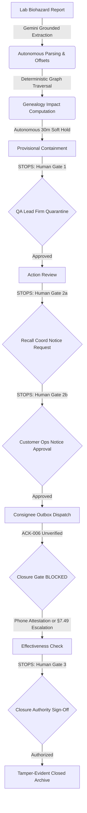

# Lot Zero — Evidence-Grounded Food Safety Recall Incident Workspace

> **Disciplined, Deterministic Recall Incident Workspace**
> *Packaged for Google Cloud Run, supporting Google Gemini on Vertex AI when configured, Deterministic Supply Chain Genealogy Traversal, Strict Separation-of-Duties Authority Kernel, FastAPI, and React.*

[](https://cloud.google.com/vertex-ai)
[](apps/api/tests/)
[](apps/web/tests/)

**Live Evaluation Deployment**: [https://lot-zero-m4vizenaoa-uc.a.run.app](https://lot-zero-m4vizenaoa-uc.a.run.app)
**Submission Repository**: [**https://github.com/ryuzaki1709/lot-zero**](https://github.com/ryuzaki1709/lot-zero)
**Demonstration Video**: `[DEMO_VIDEO_URL_PLACEHOLDER]`
**Hackathon Submission**: `[SUBMISSION_URL_PLACEHOLDER]`

---

## 1. Product Summary & Problem Statement

### One-Sentence Pitch
**Lot Zero** is an evidence-grounded recall incident workspace that ingests lab contamination signals using Google Gemini, deterministically bounds contaminated product via genealogy graph traversal (zero false holds in the synthetic evaluation fixture), enforces strict separation-of-duties authority gates, and logs tamper-evident audit ledgers for regulated food safety operations.

### The Problem
When pathogenic contamination (such as *Salmonella enterica*) is detected in a food processing facility, recall coordinators and quality assurance leads face severe challenges:
1. **Over-Containment (False Holds)**: Indiscriminate batch shutdowns quarantine unaffected lots, costing manufacturers significant losses in destroyed inventory and supply chain disruption.
2. **Under-Containment & Missing Consignee Verification**: Missed lots remain in distribution networks, and missing consignee verification records violate recall effectiveness principles.
3. **Unbounded Generative AI Risks**: Generic conversational chatbots risk hallucinating lot numbers, inventing inventory quantities, or executing actions without authorization.

### The Solution
Lot Zero replaces ad-hoc spreadsheets and unconstrained chat prompts with a **disciplined agentic architecture**:
- **Grounded Ingestion**: Gemini extracts positive pathogen findings and contaminated raw lots with verbatim character-offset citation spans dynamically verified against the lab report's SHA-256 digest.
- **Deterministic Genealogy Traversal**: Graph traversal identifies exact downstream finished batches (`FP-100-L240814-A`: 120 units, `FP-100-L240814-B`: 80 units, totaling 200 units) while the demonstrated synthetic scenario leaves clean control batches (`FP-100-ADJ`, 100 units) unheld (zero false holds in the synthetic evaluation fixture).
- **Strict Separation of Duties**: Multi-persona governance blocks self-approvals (`requester != approver`) and enforces dual signatures for biological clearance and operational release.
- **Append-Oriented Audit Integrity**: State mutations produce a SHA-256 hash-chained event ledger backing a self-verifying audit export bundle.

---

## 2. Why the System is Agentic (Disciplined Agency)

In mission-critical regulated operations, unbounded AI agents that execute arbitrary actions create severe safety and legal liabilities. Lot Zero implements **Disciplined Agency**:


```mermaid
graph TD
    A[Lab Biohazard Report] -->|Gemini Grounded Extraction| B(Autonomous Parsing & Offsets)
    B -->|Deterministic Graph Traversal| C(Genealogy Impact Computation)
    C -->|Autonomous 30m Soft Hold| D[Provisional Containment]
    D -->|STOPS: Human Gate 1| E{QA Lead Firm Quarantine}
    E -->|Approved| F[Action Review]
    F -->|STOPS: Human Gate 2a| G{Recall Coord Notice Request}
    G -->|STOPS: Human Gate 2b| H{Customer Ops Notice Approval}
    H -->|Approved| I[Consignee Outbox Dispatch]
    I -->|ACK-006 Unverified| J{Closure Gate BLOCKED}
    J -->|Phone Attestation or §7.49 Escalation| K[Effectiveness Check]
    K -->|STOPS: Human Gate 3| L{Closure Authority Sign-Off}
    L -->|Authorized| M[Tamper-Evident Closed Archive]
```

- **Where Lot Zero Acts Autonomously**:
  - Ingests unstructured lab reports and matches character spans to verified SHA-256 document digests.
  - Traverses raw material lot genealogy graphs to calculate downstream batch impacts.
  - Instantly places a 30-minute provisional soft hold (`EVAL-HOLD-01`) to protect public safety during discovery.
- **Where Lot Zero Strictly Halts**:
  - Converting soft holds to permanent firm quarantine requires **QA Lead** sign-off.
  - Drafting and approving outbound consignee recall notices requires distinct **Recall Coordinator** and **Customer Operations** approvals.
  - Final case closure is blocked while consignee acknowledgements (such as `ACK-006`) remain unverified, requiring **Customer Operations** phone attestation or documented non-response referral before **Closure Authority** sign-off.

---

## 3. Separation-of-Duties Persona Model

All actions within Lot Zero enforce separation of duties. When `LOT_ZERO_EVALUATION_MODE=true`, 5 Evaluation Personas (4 Operational Personas + Evaluation Administrator) are available:

| Persona Name | Principal ID | Role | Evaluation API Key | Responsibilities |
| :--- | :--- | :--- | :--- | :--- |
| **Evaluation Administrator** | `EVAL-ADMIN-01` | `eval_admin` | `key-eval-admin-01` | Baseline state reset, archive prior evaluation runs |
| **Recall Coordinator** | `RECALL-COORD-01` | `recall_coordinator` | `key-recall-coord-01` | Lab signal simulation, scope proposal, draft notice packet, request closure |
| **QA Lead** | `QA-LEAD-01` | `qa` | `key-qa-lead-01` | Approve firm quarantine (`AUTH-HOLD-01`), biological clearance signature |
| **Customer Operations** | `OPS-001` | `customer_operations` | `key-ops-01` | Approve notice packet, dispatch recall outbox, log consignee phone attestation |
| **Closure Authority** | `CLOSURE-AUTH-01` | `closure_authority` | `key-closure-auth-01` | Step 2 operational release, authorize final case closure |

> [!IMPORTANT]
> **Server-Enforced Anti-Self-Approval**: If an operator attempts to approve their own request (e.g. `RECALL-COORD-01` attempting to approve firm quarantine or sign closure), the authority kernel rejects the command with **HTTP 403 Forbidden** (`requester and approver must be different people`).

---

## 4. Google Gemini Usage & Deterministic Replay Behavior

### Live Gemini Grounding Mode
When configured with Google Cloud credentials (`GOOGLE_GENAI_USE_VERTEXAI=true`, `GOOGLE_CLOUD_PROJECT`, `GOOGLE_CLOUD_LOCATION="global"`), Lot Zero supports live model execution via the official `google-genai` SDK on Google Vertex AI using `gemini-3.5-flash`.
- Ingests raw Apex Micro Quality Labs unstructured laboratory text notices.
- Extracts pathogen (`Salmonella enterica serovar Typhimurium`) and contaminated lot (`ING-4417`, Organic Wheat Flour).
- Extracts exact start/end character offsets with document hash verification (the application computes the SHA-256 digest dynamically from the exact source notice text).

### Deterministic Replay Evaluation Mode
When Vertex AI credentials or project configuration are not provided, Lot Zero uses a built-in deterministic extraction engine (`gemini-3.5-flash (Deterministic Replay)`).
- Pre-grounded character-exact citations from the verified Apex Micro Quality Labs evaluation report are replayed with complete fidelity.
- Displayed prominently in the UI banner as `gemini-3.5-flash (Deterministic Replay)` to maintain transparency.

---

## 5. Supply Chain Genealogy & Clean Batch Isolation

Lot Zero executes deterministic graph traversal over batch genealogy records:

| Lot ID | Type | Quantity | Status | Isolation Rationale |
| :--- | :--- | :--- | :--- | :--- |
| `ING-4417` | Organic Wheat Flour | — | Contaminated | Positive for *Salmonella* in Apex Micro Quality Labs Report |
| `FP-100-L240814-A` | Finished Good Batch | 120.0 units | **Quarantined** | Consumed contaminated ingredient lot `ING-4417` |
| `FP-100-L240814-B` | Finished Good Batch | 80.0 units | **Quarantined** | Consumed contaminated ingredient lot `ING-4417` (total: 200.0 units) |
| `FP-100-ADJ` | Finished Good Batch | 100.0 units | **Clean (0 False Holds)** | Adjacent packaging run utilizing clean control lot `ING-4418` |

**Clean Batch Isolation in Synthetic Fixture**: The demonstrated synthetic scenario leaves `FP-100-ADJ` unheld, achieving zero false holds in the synthetic evaluation fixture and preventing unnecessary destruction of clean inventory.

---

## 6. Audit Export & Tamper-Evident Hash Chain

Every state transition appends an event to the incident ledger with a SHA-256 hash chain:
$$\text{entry\_hash}_n = \text{SHA256}(\text{prior\_entry\_hash}_{n-1} \parallel \text{event\_id} \parallel \text{event\_type} \parallel \text{timestamp} \parallel \text{payload\_digest})$$

### Export & Verification
Judges can download the self-verifying audit bundle directly via **Export Audit Bundle** or:
```bash
curl -s http://localhost:8000/api/cases/EVAL-CASE-01/audit-export \
     -H "X-API-Key: key-recall-coord-01"
```
The export returns:
- `case_id`, `tenant_id`, and `total_events`
- `root_digest`: Top-level hash representing the entire chained history.
- `events`: Array of chained events containing `entry_hash`, `prior_entry_hash`, and signed authority payloads.

*Note on Tamper Evidence*: The verifier detects post-export payload changes, reordering, or record removal when checked against the originally retained root digest. Stronger completeness guarantees require an independently retained checkpoint.

---

## 7. Evaluation Mode vs. Production Configuration

Lot Zero clearly differentiates between its evaluation harness and production configuration:

| Dimension | Evaluation Mode (`LOT_ZERO_EVALUATION_MODE=true`) | Non-Evaluation Mode (`LOT_ZERO_EVALUATION_MODE=false`) |
| :--- | :--- | :--- |
| **Persona Switcher** | Enabled in top navigation bar | Disabled; UI displays active principal ID |
| **Authentication** | Fixed evaluation API keys (`key-recall-coord-01`, etc.) | Requires configured `LOT_ZERO_API_KEYS` JSON mapping |
| **Reset Endpoint** | `POST /api/evaluation/reset` active (archives prior run) | `404 Not Found` (endpoint disabled) |
| **SSE Authentication** | Ephemeral HMAC token via `GET /api/evaluation/auth/token` | Ephemeral HMAC token signed by configured `LOT_ZERO_SSE_SECRET` |
| **Event Storage** | Append-oriented SQLite with evaluation run archiving | Append-oriented SQLite (local filesystem path) |

---

## 8. Local Setup & Quick Start (Windows / PowerShell)

### Prerequisites
- **Python**: 3.11+ (verified on Python 3.12)
- **Node.js**: 18+ and `npm`

### Step 1: Clone Repository
```powershell
git clone https://github.com/ryuzaki1709/lot-zero.git
cd lot-zero
```

### Step 2: Set Up Python Backend Environment
```powershell
python -m venv .venv
.\.venv\Scripts\Activate.ps1
python -m pip install --upgrade pip
pip install -r constraints-dev.txt
pip install -e .\apps\api
```

### Step 3: Set Up React Frontend
```powershell
cd apps\web
npm ci
npm run build
cd ..\..
```

### Step 4: Launch Backend Service
```powershell
$env:LOT_ZERO_EVALUATION_MODE = "true"
.\.venv\Scripts\python.exe -m uvicorn lot_zero.app:app --host 127.0.0.1 --port 8000 --app-dir apps/api/src
```
Navigate to [**http://localhost:8000**](http://localhost:8000) in your web browser.

---

## 9. Environment Variable Reference

The application runtime is configured via the following environment variables:

| Variable Name | Required in Production | Default Value | Description |
| :--- | :--- | :--- | :--- |
| `LOT_ZERO_EVALUATION_MODE` | No | `false` | Enables evaluation persona switcher, demo keys, and reset endpoints. |
| `LOT_ZERO_DB_PATH` | No | `lot_zero.db` | Path to SQLite database file. |
| `LOT_ZERO_TENANT_ID` | No | `EVAL-TENANT-01` | Active evaluation tenant identifier. |
| `LOT_ZERO_SSE_SECRET` | Yes (in Prod) | `""` (or default in eval) | Secret key (minimum 32 characters) used to sign ephemeral SSE tokens. |
| `LOT_ZERO_API_KEYS` | Yes (in Prod) | `None` | JSON string mapping API keys to principal records. |
| `LOT_ZERO_ALLOWED_ORIGINS` | Yes (in Prod) | `[]` (or localhost in eval) | Comma-separated list of allowed CORS origins. |
| `GOOGLE_GENAI_USE_VERTEXAI` | No | `false` | Enables Vertex AI Gemini inference via `google-genai` SDK when configured. |
| `GOOGLE_CLOUD_PROJECT` | If Vertex AI | `""` | Google Cloud project ID for Vertex AI access. |
| `GOOGLE_CLOUD_LOCATION` | No | `global` | Vertex AI model location. |
| `GEMINI_API_KEY` | No | `""` | API key fallback for Google GenAI Studio. |

---

## 10. Automated Testing & Verification

### Backend Verification Suite
```powershell
# Run 169 unit, integration, and contract tests
.\.venv\Scripts\python.exe -m pytest .\apps\api\tests -q --tb=short -p no:cacheprovider

# Run Ruff linter and formatter checks
.\.venv\Scripts\python.exe -m ruff check .\apps\api
.\.venv\Scripts\python.exe -m ruff format --check .\apps\api

# Run Mypy static type checker
.\.venv\Scripts\python.exe -m mypy .\apps\api\src
```

### Frontend Verification Suite
```powershell
cd apps\web
# Run 25 unit and workflow race synchronization tests
npm test

# Run Cloudflare / Sites static worker tests
npm run test:sites

# Verify production Vite build
npm run build
cd ..\..
```

### End-to-End Verification Scripts
```powershell
# Verify entire 9-step lifecycle synchronization without manual refresh
.\.venv\Scripts\python.exe .\scripts\verify_sync_lifecycle.py

# Verify role authorization gates and non-admin denial
.\.venv\Scripts\python.exe .\scripts\verify_acceptance.py

# Verify cold-boot SQLite event rehydration and audit chain
.\.venv\Scripts\python.exe .\scripts\verify_runtime_lifecycle.py
```

---

## 11. Containerized Execution (Docker)

> [!NOTE]
> *Docker builds use a multi-stage Dockerfile packaging the Vite frontend into FastAPI. If Docker is not available locally, use the PowerShell instructions in Section 8.*

```bash
# Build multi-stage container
docker build -t lot-zero:latest .

# Run container in evaluation mode (ephemeral local SQLite)
docker run -p 8000:8000 \
  -e LOT_ZERO_EVALUATION_MODE=true \
  -e LOT_ZERO_DB_PATH=/tmp/lot_zero.db \
  lot-zero:latest
```

---

## 12. Complete Judge Evaluation Persona Workflow

Follow this workflow in the web UI ([http://localhost:8000](http://localhost:8000)):

1. **Reset Baseline State** (`Evaluation Administrator`):
   - Switch persona to **Evaluation Administrator** in the top bar.
   - Click **Reset State** -> Confirm. The incident reinitializes to the baseline `signal_received` phase and archives prior runs.
2. **Ingest Lab Safety Signal** (`Recall Coordinator`):
   - Switch persona to **Recall Coordinator**.
   - Click **Simulate Signal**. Grounded extraction ingests Apex Micro Quality Labs report.
   - The system computes genealogy: `ING-4417` $\to$ `FP-100-L240814-A` (120 units) and `FP-100-L240814-B` (80 units), totaling 200 units, and places a 30m soft hold, advancing the case to `provisional_containment`.
3. **Approve Firm Quarantine** (`QA Lead`):
   - Switch persona to **QA Lead**.
   - Click **Approve Firm Quarantine (QA)** with rationale. Policy upgrades to `AUTH-HOLD-01` and advances the case to `action_review`.
4. **Draft & Approve Outbound Notice**:
   - Switch to **Recall Coordinator**: Click **Request Notification Packet (Coord)**.
   - Switch to **Customer Operations**: Click **Approve Notification Packet (Ops)**.
5. **Dispatch Recall Outbox** (`Customer Operations`):
   - Click **Dispatch Recall Outbox (Ops)**. The incident enters the `ack_monitoring` phase.
   - Notice that consignee `ACK-006` is marked **Unverified**, keeping the Closure Gate **BLOCKED**.
6. **Request Closure & Blocked State Check**:
   - Switch to **Recall Coordinator**: Click **Request Incident Closure (Coord)**.
   - The closure gate clearly displays: *Awaiting verified consignment acknowledgement from: ACK-006*.
7. **Resolve Outstanding Consignee** (`Customer Operations`):
   - Under Consignee Outreach, click **Log Phone Attestation** for `ACK-006` -> Submit. The case advances to `effectiveness_check`.
8. **Authorize Final Case Closure** (`Closure Authority`):
   - Switch persona to **Closure Authority**.
   - Click **Authorize Final Closure (Auth)**. The case advances to `closed`.
9. **Export Audit Bundle**:
   - Click **Export Audit Bundle** in the top bar to inspect the SHA-256 chained JSON ledger.

---

## 13. Known Limitations & Honest Technical Disclosures

1. **Evaluation Single-Instance Concurrency**: The FastAPI application uses an asynchronous state lock (`state_lock`) with an in-memory `current_state` cache backed by SQLite. Multi-worker load-balanced deployments require distributed leasing or a managed database backend.
2. **Local Append-Oriented Storage vs. Immutable Hardware**: The application stores events in an append-oriented SQLite table (`incident_events`) and enforces tamper-evidence cryptographically via SHA-256 hash chains in the audit export. Mutable database files on disk are not dedicated hardware WORM (Write Once, Read Many) storage.
3. **Regulatory Framing**: Lot Zero is a synthetic internal workflow modeled to demonstrate controls inspired by FDA recall-effectiveness practices, including a documented non-response/referral path. The application records synthetic filing IDs and referral notes; it does not communicate with the FDA Electronic Submissions Gateway (ESG) or certify statutory compliance.
4. **Authentication Scope**: Production mode uses configured API-key mappings (`LOT_ZERO_API_KEYS`) with Bearer/header lookup. Enterprise OIDC/SAML identity provider integration is future work.

---

## 14. Project Links & Documentation

- **Live Service URL**: [https://lot-zero-m4vizenaoa-uc.a.run.app](https://lot-zero-m4vizenaoa-uc.a.run.app)
- **GitHub Repository**: [https://github.com/ryuzaki1709/lot-zero](https://github.com/ryuzaki1709/lot-zero)
- **Demonstration Video**: `[DEMO_VIDEO_URL_PLACEHOLDER]`
- **Submission Document**: [docs/submission.md](docs/submission.md)
- **Technical Architecture Guide**: [docs/architecture.md](docs/architecture.md)
- **Security & Trust Specification**: [docs/security.md](docs/security.md)
- **Demo Script**: [docs/demo_script.md](docs/demo_script.md)
- **Deployment Specification**: [docs/deployment.md](docs/deployment.md)
- **Deployment Evidence & Verification**: [docs/deployment_evidence.md](docs/deployment_evidence.md)
- **Late-Submission Rescue & Portfolio Launch**: [docs/late_submission_rescue.md](docs/late_submission_rescue.md)
