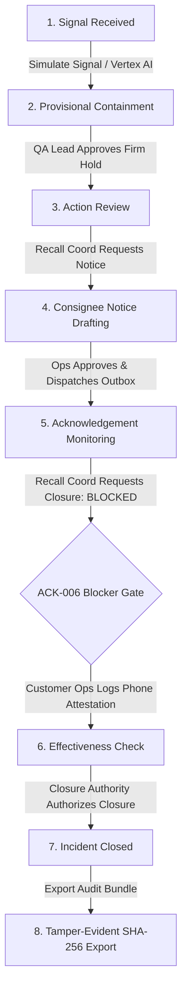

# Lot Zero — Video Recording Runbook & Demo Script

A step-by-step production runbook for recording the 3-to-4-minute judge walkthrough video for **Lot Zero**.

- **Public Live URL**: [https://lot-zero-m4vizenaoa-uc.a.run.app](https://lot-zero-m4vizenaoa-uc.a.run.app)
- **Canonical Health Endpoint**: [https://lot-zero-m4vizenaoa-uc.a.run.app/api/health](https://lot-zero-m4vizenaoa-uc.a.run.app/api/health)
- **Repository**: [https://github.com/ryuzaki1709/lot-zero](https://github.com/ryuzaki1709/lot-zero)
- **Deployment Evidence**: [docs/deployment_evidence.md](deployment_evidence.md)

---

## PART A — Pre-Recording Checklist & Environment Setup

Before starting screen capture, ensure all pre-flight checks are complete:

1. **Verify Live Service Health & Pre-Warm Cloud Run**:
   - Open `https://lot-zero-m4vizenaoa-uc.a.run.app/api/health` in a browser tab to pre-warm the Cloud Run instance and eliminate cold-start latency prior to recording.
   - Confirm JSON response: `{"status": "ok", "service": "lot-zero-api", "tenant": "EVAL-TENANT-01", "evaluation_mode": true}`.
2. **Verify Evaluation Personas**:
   - Open `https://lot-zero-m4vizenaoa-uc.a.run.app/api/config`.
   - Confirm exactly **5 human evaluation personas** are loaded:
     - `RECALL-COORD-01` (Recall Coordinator)
     - `QA-LEAD-01` (QA Lead)
     - `OPS-001` (Customer Operations)
     - `CLOSURE-AUTH-01` (Closure Authority)
     - `EVAL-ADMIN-01` (Evaluation Administrator)
   - Ensure `AGENT-SVC-01` is not present in the persona selector.
3. **Reset Incident State**:
   - In the live UI, select **Evaluation Administrator** from the top-right persona menu.
   - Click **Reset State** and confirm the prompt.
   - Verify the case re-seeds to the initial `signal_received` state with an empty live evidence ledger.
4. **Recording Window & Viewport**:
   - Use a dedicated, clean browser window (Chrome or Firefox) without bookmarks bar or extensions visible.
   - Set viewport resolution to a stable **1920x1080** (1080p) or **1440x900**.
   - Close all personal messaging apps, email clients, DevTools panels, and OS notifications.
5. **Live Model Fallback Plan**:
   - Live signal extraction queries Google Gemini 3.5 Flash on Vertex AI (`global` endpoint).
   - If Vertex AI returns a `needs_review` extraction status due to rate limits or transient latency, the UI clearly displays the review-required banner. Explain that Lot Zero intentionally halts on low-confidence extraction rather than fabricating ungrounded holds.

---

## PART B — 4-Minute End-to-End Demo Workflow

Follow this sequence focusing on domain states and separation-of-duties gates:

### 1. Problem & Product Thesis (0:00 - 0:25)
- **Action**: Display the clean Lot Zero workspace on `https://lot-zero-m4vizenaoa-uc.a.run.app`.
- **Narration Focus**: Highlight the core problem in food recalls: over-containment causes unnecessary destruction of clean inventory and operational disruption, while ungrounded AI chatbots hallucinate quantities and breach authority boundaries. State the Lot Zero thesis: **"AI proposes; deterministic authority decides."**

### 2. Signal Simulation & Grounded Extraction (0:25 - 0:55)
- **Action**:
  - Switch persona to **Recall Coordinator**.
  - Click **Simulate Signal**.
- **Visuals to Highlight**:
  - Model provenance badge: **`gemini-3.5-flash (Vertex AI Live)`**.
  - Pathogen identified: *Salmonella enterica serovar Typhimurium*.
  - Grounded raw ingredient lot: `ING-4417`.
  - Three verbatim character-offset citation spans verified against the lab report's SHA-256 digest.

### 3. Supply Chain Genealogy Traversal (0:55 - 1:20)
- **Action**: Scroll to the **Supply Chain Genealogy Graph** and **Containment Scope Card**.
- **Visuals to Highlight**:
  - Autonomous 30-minute soft hold placed on contaminated raw lot `ING-4417` and downstream finished batches `FP-100-L240814-A` (120 units) and `FP-100-L240814-B` (80 units), totaling 200 units.
  - The demonstrated synthetic scenario leaves clean control batch `FP-100-ADJ` (100 units, utilizing clean control lot `ING-4418`) unheld (zero false holds in the synthetic evaluation fixture).
  - Case state moves to `provisional_containment`.

### 4. QA Lead Firm Quarantine Gate (1:20 - 1:50)
- **Action**:
  - Switch persona to **QA Lead**.
  - Click **Approve Firm Quarantine (QA)**.
- **Visuals to Highlight**:
  - Standing policy upgrades soft hold to firm quarantine (`AUTH-HOLD-01`).
  - Separation of duties enforced: Recall Coordinator cannot approve their own quarantine request.
  - Case state advances to `action_review`.

### 5. Staged Notice Request & Operations Dispatch (1:50 - 2:20)
- **Action**:
  - Switch persona to **Recall Coordinator** -> Click **Request Notification Packet (Coord)**.
  - Switch persona to **Customer Operations** -> Click **Approve Notification Packet (Ops)**.
  - Click **Dispatch Recall Outbox (Ops)**.
- **Visuals to Highlight**:
  - Staged consignee packets (`PKT-001`) dispatched to distribution network after human operational approval.
  - Incident moves to `ack_monitoring` state.

### 6. Closure Block Demonstration & ACK-006 Resolution (2:20 - 2:55)
- **Action**:
  - Switch persona to **Recall Coordinator** -> Click **Request Incident Closure (Coord)**.
  - Point to the closure blocker: **Awaiting verified consignment acknowledgement from: ACK-006**.
  - Switch persona to **Customer Operations**.
  - Under Consignee Outreach, find `ACK-006` -> Click **Log Phone Attestation** -> Enter caller details -> Click **Submit Attestation**.
- **Visuals to Highlight**:
  - `ACK-006` updates to verified status.
  - Case advances to `effectiveness_check` state.

### 7. Dual-Signature Final Case Closure (2:55 - 3:20)
- **Action**:
  - Switch persona to **Closure Authority**.
  - Click **Authorize Final Closure (Auth)**.
- **Visuals to Highlight**:
  - Final biological and operational clearances verified.
  - Case advances to `closed` state.

### 8. Tamper-Evident SHA-256 Audit Export & Live Service Evidence (3:20 - 3:45)
- **Action**:
  - Click **Export Audit Bundle** in the top navigation header.
  - Show the exported JSON structure in a clean tab.
  - Highlight live `.run.app` deployment, canonical `/api/health`, and model provenance.
- **Visuals to Highlight**:
  - Every event in the recorded incident stream is cryptographically chained via SHA-256 to its predecessor.
  - The verifier detects post-export payload changes, reordering, or record removal when checked against the originally retained root digest. Stronger completeness guarantees require an independently retained checkpoint.
  - Live execution on Google Cloud Run with Vertex AI Gemini 3.5 Flash and Secret Manager.

---

## PART C — Word-for-Word Narration Script (Target: Under 3:45)

*(Note: Timing targets are approximate; verify pacing during rehearsal.)*

### Scene 1: Introduction & The Grounding Problem (0:00 - 0:25)
> *"In food manufacturing, contamination incidents like Salmonella demand rapid, high-stakes decisions. Traditional recalls suffer from two extremes: over-containment that causes unnecessary destruction of clean inventory and operational disruption, or naive AI chatbots that hallucinate lot numbers and breach authority boundaries.
> 
> *This is **Lot Zero** — an evidence-grounded recall incident workspace built on Google Cloud Run and Vertex AI with Disciplined Agency: **AI proposes; deterministic authority decides.***

### Scene 2: Lab Signal Simulation & Vertex AI Gemini (0:25 - 0:55)
> *We start as the **Recall Coordinator**. When a positive lab notice arrives from Apex Micro Quality Labs, we trigger our ingestion pipeline.*
> 
> *Here, Google Gemini 3.5 Flash on Vertex AI parses the unstructured laboratory text notice. Notice the model provenance badge confirming live Vertex execution. Gemini extracts contaminated raw lot `ING-4417` (Organic Wheat Flour) with grounded extraction and deterministic validation, binding its findings to exact character-offset citation spans checked against the report's SHA-256 digest. Inventory quantities are derived by the deterministic fixture-backed genealogy engine, not generated by the model.*

### Scene 3: Supply Chain Genealogy & Clean Batch Isolation (0:55 - 1:20)
> *Next, our deterministic supply chain graph traverses the genealogy tree. It identifies that `ING-4417` was used in finished batches `FP-100-L240814-A` (120 units) and `FP-100-L240814-B` (80 units) — quarantining 200 units on a 30-minute provisional soft hold.*
> 
> *Crucially, the demonstrated synthetic scenario leaves clean control batch `FP-100-ADJ` (100 units, utilizing clean lot `ING-4418`) unheld — achieving zero false holds in the synthetic evaluation fixture and avoiding unnecessary product destruction while isolating the biohazard immediately.*

### Scene 4: Separation of Duties & Consignee Outreach (1:20 - 1:50)
> *Because safety requires dual sign-off, the Recall Coordinator cannot approve their own quarantine. We switch to our **QA Lead**, who reviews the grounded evidence and signs the firm hold policy.*
> 
> *We then stage customer notification packets. The Recall Coordinator requests the notice, and **Customer Operations** approves and dispatches the outbox to downstream distributors.*

### Scene 5: Guardrails Against Premature Closure (1:50 - 2:20)
> *Now, if the Recall Coordinator attempts to close the incident early, Lot Zero's authority kernel strictly **blocks closure** because distributor `ACK-006` has not verified product receipt.*
> 
> *Customer Operations resolves this by contacting the distributor and recording a verified phone attestation directly into the event ledger, advancing the incident to effectiveness check.*

### Scene 6: Dual-Signature Final Closure (2:20 - 2:55)
> *Next, our **Closure Authority** reviews operational and biological clearances and signs the final release, advancing the case to `closed`.*

### Scene 7: Audit Export & Cloud Run Provenance (2:55 - 3:20)
> *With a single click, we export the recorded incident event stream. Every single state mutation is cryptographically chained using SHA-256 hashes to its predecessor. The verifier detects post-export payload changes, reordering, or record removal when checked against the originally retained root digest. Stronger completeness guarantees require an independently retained checkpoint.*

### Scene 8: Live Cloud Run Conclusion (3:20 - 3:45)
> *All running live on Google Cloud Run at our `.run.app` domain, verified via canonical `/api/health`, backed by Google Secret Manager and Vertex AI Gemini 3.5 Flash. Thank you.*

---

## PART D — Recovery & Troubleshooting Runbook

If an unexpected behavior occurs during a recording take, follow these instant recovery steps:

| Issue | Root Cause | Immediate Recovery Action |
| :--- | :--- | :--- |
| **State Reset / Lost Progress** | Cloud Run instance recycled during cold start. | Switch to **Evaluation Administrator**, click **Reset State**, and restart the take from Step 1. |
| **Model returns `needs_review`** | Vertex AI rate limit or transient extraction latency. | Explain that Lot Zero intentionally halts on low-confidence extraction rather than placing unsafe ungrounded holds, or reset and re-trigger simulation. |
| **Button Disabled / 403 Forbidden** | Active persona does not match required role gate. | Check the required role on the button badge (e.g. `(QA)`, `(Ops)`, `(Auth)`) and switch to the matching persona in the top-right menu. |
| **Closure Gate Remains Blocked** | `ACK-006` phone attestation not yet submitted. | Switch to **Customer Operations**, scroll to Consignee Outreach, and submit attestation for `ACK-006`. |
| **Browser Out-of-Sync** | Network hiccup on SSE subscription. | Click the manual **Refresh** button in the header or hard-refresh the page (`Ctrl+F5`). |
