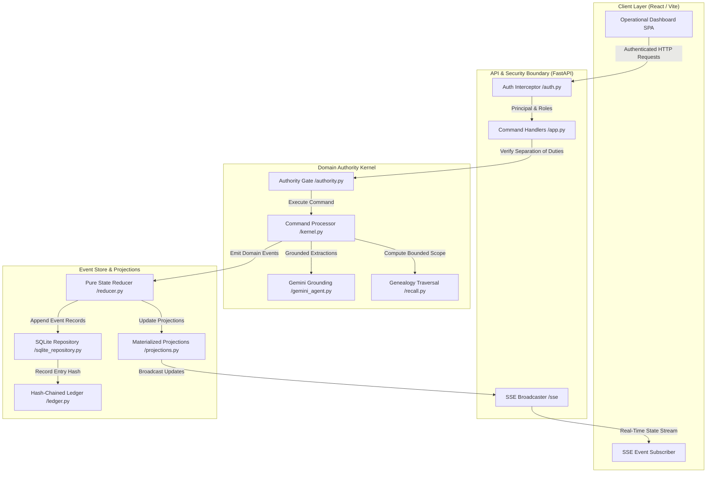
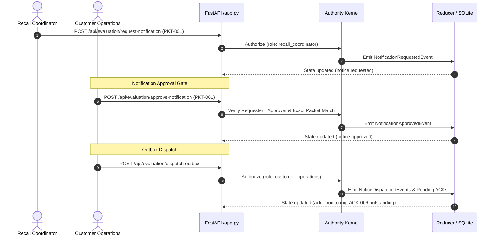
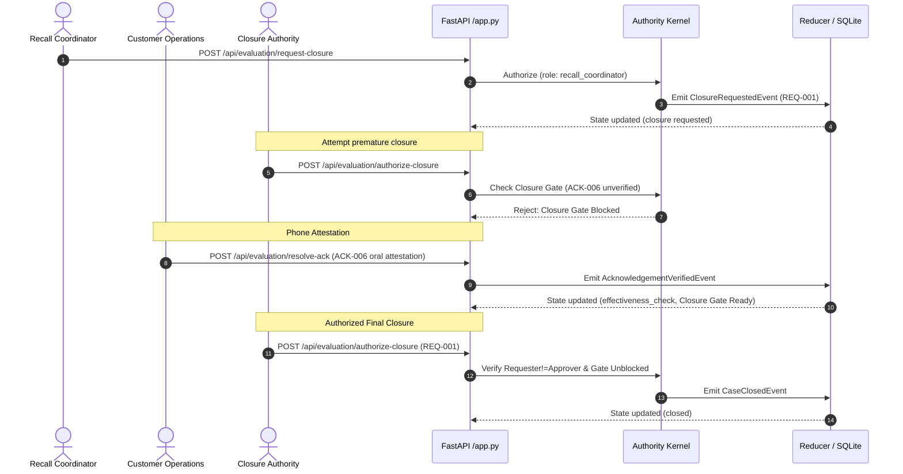
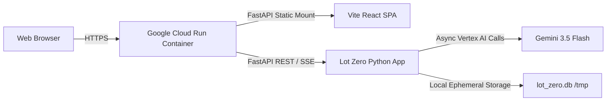

# Lot Zero — Technical Architecture

This document describes the architectural design, event flow, state transitions, security boundaries, and runtime topology of **Lot Zero**.

---

## 1. System Context & High-Level Flow

Lot Zero is structured as a decoupled, event-driven web application with a deterministic Python domain kernel at its center.



---

## 2. Command & Event Processing Lifecycle

All domain mutations are driven by command packets processed through the deterministic authority kernel:

1. **Client Dispatches Command**: The frontend constructs a request (e.g. `POST /api/evaluation/approve-containment`) authenticated with the active operator's `X-API-Key`.
2. **Authentication & Identity Resolution**: [`auth.py`](../apps/api/src/lot_zero/auth.py) extracts the principal ID, tenant ID, and role permissions from configured API-key mappings across 5 Evaluation Personas (4 Operational Personas + Evaluation Administrator).
3. **Separation of Duties Verification**: [`authority.py`](../apps/api/src/lot_zero/domain/authority.py) verifies:
   - The operator possesses the required role (e.g. `qa`).
   - The approver is distinct from the requester (`requester_id != approver_id`).
   - The referenced proposal/packet/scope actually exists in the persisted event history.
4. **Command Execution**: [`kernel.py`](../apps/api/src/lot_zero/domain/kernel.py) evaluates current state, verifies optimistic concurrency version (`case_version`), and produces domain events.
5. **Pure State Reduction**: [`reducer.py`](../apps/api/src/lot_zero/domain/reducer.py) applies the events to produce an updated `IncidentState`.
6. **Persistence & Cryptographic Chaining**: [`sqlite_repository.py`](../apps/api/src/lot_zero/adapters/sqlite_repository.py) writes the events to `incident_events` and calculates the next SHA-256 hash in the chain.
7. **Projection & Broadcast**: Updated read models and wire projections are compiled by [`selectors.py`](../apps/api/src/lot_zero/domain/selectors.py) and broadcast to connected SSE clients.

---

## 3. Workflow Sequences

### A. Notification Request, Approval & Dispatch Sequence



---

### B. Consignee Resolution, Closure Request & Authorization Sequence



---

## 4. Multi-Tenant Isolation & Boundaries

- **Tenant Scoping**: Every database record and event entry is keyed by `tenant_id` (`EVAL-TENANT-01`).
- **Database Schema**: The SQLite event store enforces tenant boundaries:
  ```sql
  CREATE TABLE IF NOT EXISTS incident_events (
      tenant_id TEXT NOT NULL,
      case_id TEXT NOT NULL,
      stream_version INTEGER NOT NULL,
      event_id TEXT NOT NULL,
      event_type TEXT NOT NULL,
      payload TEXT NOT NULL,
      entry_hash TEXT NOT NULL,
      prior_entry_hash TEXT NOT NULL,
      created_at TEXT NOT NULL,
      PRIMARY KEY (tenant_id, case_id, stream_version)
  );
  ```
- **Cross-Tenant Refusal**: Any request containing a principal whose tenant does not match the requested case returns `403 Forbidden` or `404 Not Found`.

---

## 5. Evaluation State Archiving & Reset Mechanism

To prevent test-run pollution during judging, `POST /api/evaluation/reset` executes an **archived baseline reset**:
1. It queries all events for `EVAL-TENANT-01`.
2. It transfers the existing events into `archived_evaluation_runs` with a timestamped `run_id`.
3. It initializes a clean baseline case in the `signal_received` phase for `EVAL-CASE-01`.
4. It broadcasts the clean baseline state to all SSE subscribers.

---

## 6. Server-Sent Events (SSE) Lifecycle & Token Authentication

1. **Client Token Request**: The SPA fetches an ephemeral token from `GET /api/evaluation/auth/token` authenticated via `X-API-Key`.
2. **HMAC Signature**: The backend generates an HMAC-SHA256 token encoding the principal ID, tenant ID, and an expiration timestamp (60s TTL).
3. **SSE Connection**: The frontend establishes `EventSource('/api/events?token=<hmac_token>')`.
4. **Broadcast Loop**: When any domain mutation updates `current_state`, `broadcast_state()` serializes the incident projection and delivers it across open SSE connections.

---

## 7. Deployment Topology (Google Cloud Run)



---

## 8. Architectural Limitations & Future Work

1. **In-Memory Concurrency & Single-Instance Lock**: The application uses `asyncio.Lock()` (`state_lock`) around in-memory `current_state`. Scaling horizontally requires migrating to a managed distributed transactional database (such as Google Cloud SQL for PostgreSQL or Cloud Spanner) with distributed optimistic concurrency leases.
2. **Local Ephemeral SQLite on Cloud Run**: In evaluation deployment, SQLite runs on container-local ephemeral storage. State resets when a new revision deploys or after cold start recycling. Persistent enterprise deployment requires a managed database backend.
3. **Identity Provider Integration & Secret Management**: Current authentication resolves principals via configured API-key dictionaries. Integration with enterprise OIDC/SAML providers and runtime Secret Manager binding is planned as future work.
